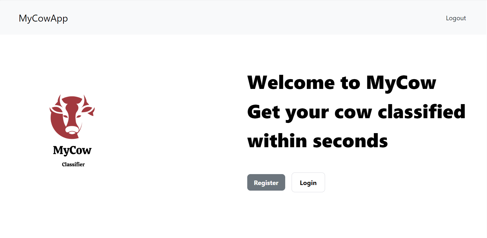
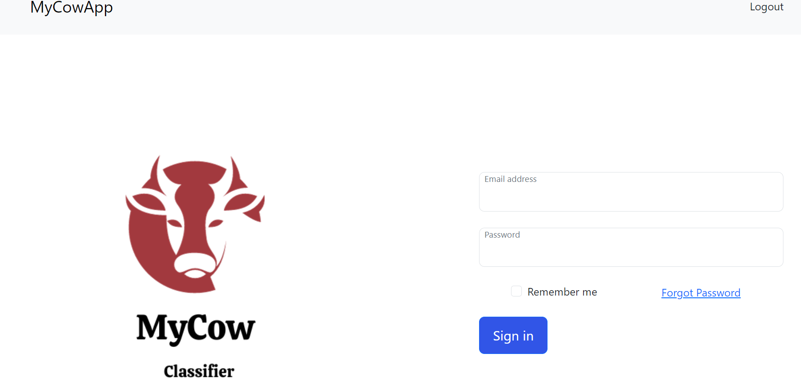
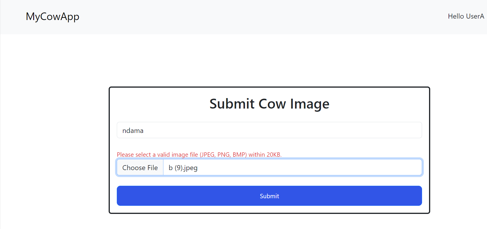
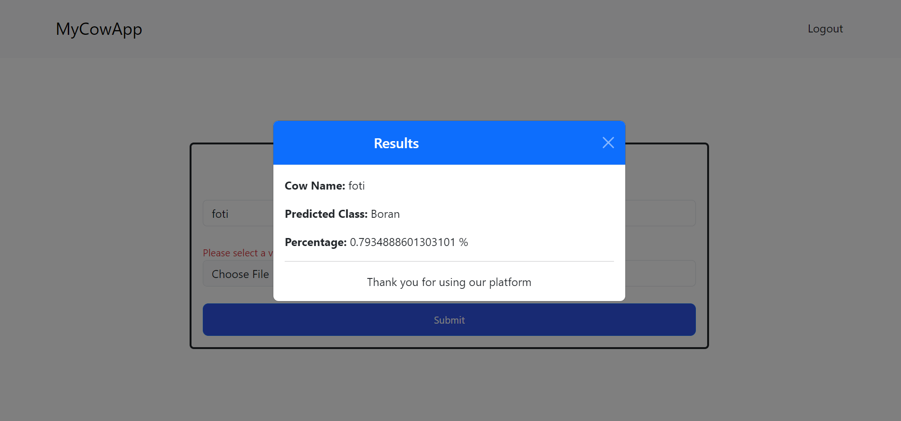
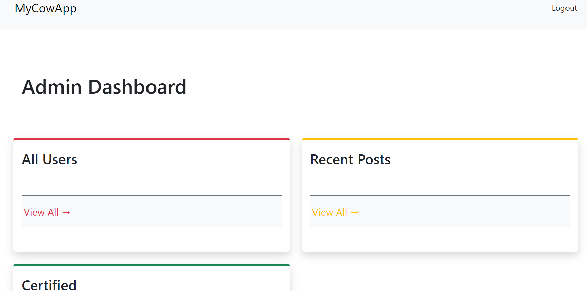

# Vue.js Frontend Application

Welcome to the Vue.js frontend application repository! This application serves as the user interface for interacting with our cow breed classification system. Users can log in, submit images of cows, and view classification results using this frontend application.

## Features

- **User Authentication:** Secure authentication system allows users to register, log in, and log out.
- **Image Submission:** Users can upload images of cows for breed classification.
- **Classification Results:** View classification results for submitted images.
- **Admin Dashboard:** Administrators have access to an admin dashboard for managing submissions and certifications.

## Setup

To set up and run the Vue.js frontend application locally, follow these steps:

1. Clone the repository: `git clone <repository_url>`
2. Install dependencies: `npm install`
3. Start the development server: `npm run serve`
4. Open your web browser and navigate to the provided URL (usually `http://localhost:8080`)

## Screenshots

*Landing Page*

*Login Upload*

*Image Upload*

*Results*

*Image Upload*

## Technologies Used

- **Vue.js:** JavaScript framework for building user interfaces.
- **Vue Router:** Official router for Vue.js applications, enabling navigation between pages.
- **Vuex:** State management library for Vue.js applications, used for managing application state.
- **Axios:** HTTP client for making API requests to the backend server.
- **Bootstrap Vue:** UI framework for building responsive and mobile-first websites using Vue.js components.

## Contributing

Contributions to this Vue.js frontend application are welcome! If you encounter any issues or have suggestions for improvements, feel free to open an issue or submit a pull request.

## License

This Vue.js frontend application is open-source software licensed under the [MIT License](LICENSE).
